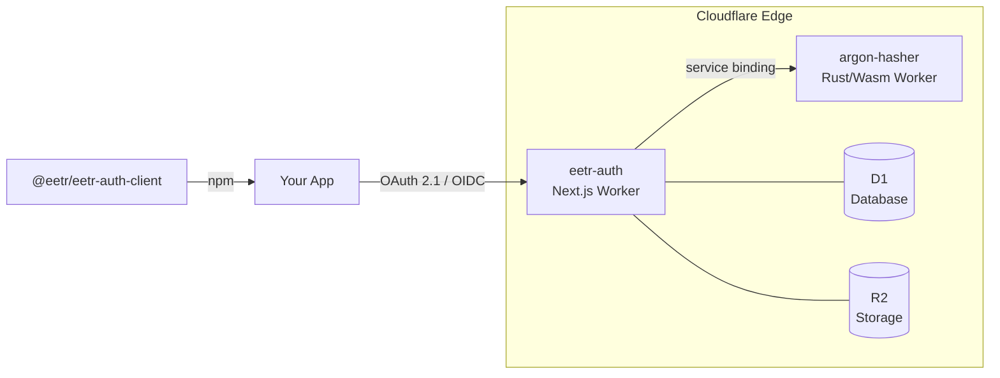
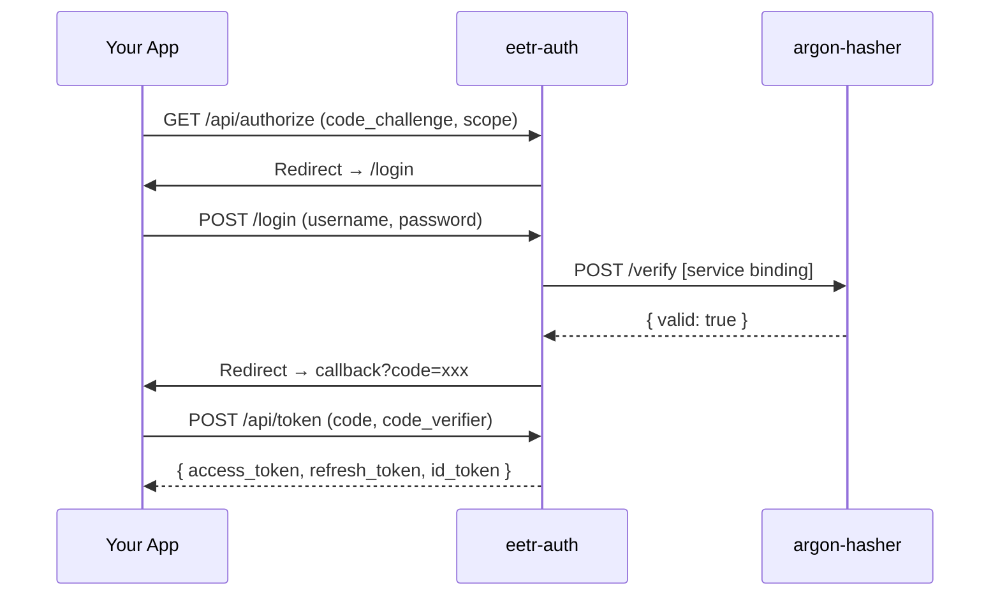
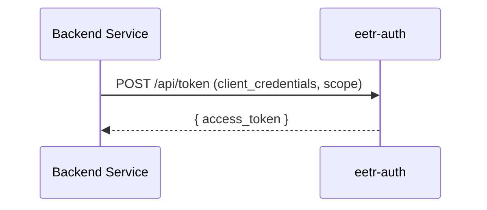

# eetr-auth

> A production-ready **OAuth 2.1 + OpenID Connect** authorization server, built for the Cloudflare edge.

Current release baseline: `0.1.0`. See [CHANGELOG.md](CHANGELOG.md).

[](https://workers.cloudflare.com)
[](https://nextjs.org)
[](https://www.typescriptlang.org)
[](https://www.rust-lang.org)
[](LICENSE)

---

## What is this?

`eetr-auth` is a self-hostable OAuth 2.1 / OIDC authorization server that runs entirely on **Cloudflare's edge platform** — no VMs, no containers, no servers. It ships as an npm monorepo with two Cloudflare Workers and a client library ready to publish.



---

## Features

| Category | Highlights |
|---|---|
| **OAuth 2.1** | Authorization Code + PKCE (S256), Client Credentials, Refresh Token with rotation |
| **OpenID Connect** | OIDC discovery, JWKS endpoint, `/userinfo`, ID tokens (RS256) |
| **Authentication** | Password (Argon2id), Passkeys (WebAuthn), MFA via email OTP |
| **User flows** | Registration, email verification, password reset |
| **Admin** | Dashboard for users, clients, tokens, site settings |
| **Infrastructure** | Cloudflare D1 (SQLite), R2 (object storage), Terraform provisioning |
| **Security** | Argon2id hashing in isolated WASM worker, HMAC-SHA256 request signing, PKCE mandatory |
| **Client library** | `@eetr/eetr-auth-client` — token management, typed API, JWT validation |

---

## Monorepo Structure

```
eetr-auth/
├── apps/
│   ├── auth/               # Next.js 16 OAuth/OIDC server (Cloudflare Worker)
│   └── argon-hasher/       # Rust/Wasm password hashing worker
└── packages/
    └── eetr-auth-client/   # @eetr/eetr-auth-client (TypeScript, publishable)
```

---

## Quick Start

### Prerequisites

- Node.js 20+
- Rust + `wasm32-unknown-unknown` target
- Wrangler CLI v4+
- Terraform CLI v1.5+
- A Cloudflare account

### 1. Clone and install

```bash
git clone https://github.com/eetr-ai/eetr-auth.git
cd eetr-auth
npm install
```

### 2. Deploy the password hasher

> This must be deployed before the auth server.

```bash
npm run deploy:argon-hasher
```

### 3. Provision infrastructure and deploy

```bash
cd apps/auth

# Provision D1 + R2 via Terraform
cd infra/terraform && terraform init && terraform apply && cd ../..

# Generate deployment config, upload secrets, migrate DB
npm run infra:terraform-output
npm run infra:render-wrangler
npm run jwt:setup-secrets
npm run infra:provision
npm run db:migrate:remote
npm run db:create-admin:remote

# Deploy
npm run deploy
```

See [docs/DEPLOYMENT.md](docs/DEPLOYMENT.md) for the complete step-by-step guide.

---

## Using the Client Library

```bash
npm install @eetr/eetr-auth-client
```

### Validate a JWT

```typescript
import { validateJwt } from '@eetr/eetr-auth-client'

const payload = await validateJwt(
  accessToken,
  'https://auth.yourdomain.com/api/jwks.json'
)
```

### Manage tokens

```typescript
import { TokenManager, fetchOIDCDiscovery } from '@eetr/eetr-auth-client'

const discovery = await fetchOIDCDiscovery('https://auth.yourdomain.com')

const manager = new TokenManager({
  issuerUrl: 'https://auth.yourdomain.com',
  clientId: 'your-client-id',
  tokenEndpoint: discovery.token_endpoint,
})

const token = await manager.getAccessToken() // auto-refreshes when expired
```

### Call the userinfo endpoint

```typescript
import { getUserInfo } from '@eetr/eetr-auth-client'

const user = await getUserInfo(accessToken, discovery.userinfo_endpoint)
```

---

## Authentication Flows

### Authorization Code + PKCE



### Client Credentials



---

## Documentation

| Document | Description |
|---|---|
| [docs/ARCHITECTURE.md](docs/ARCHITECTURE.md) | System design, package breakdown, bindings, flows, infrastructure |
| [docs/FEATURES.md](docs/FEATURES.md) | Full feature listing across all packages |
| [docs/DEPLOYMENT.md](docs/DEPLOYMENT.md) | Step-by-step deploy, local dev, env vars, troubleshooting |
| [docs/CLOUDFLARE_TEMPLATE.md](docs/CLOUDFLARE_TEMPLATE.md) | Using this as a Cloudflare template for your project |
| [CHANGELOG.md](CHANGELOG.md) | Monorepo release history |
| [PLAN.md](PLAN.md) | Monorepo migration plan and implementation status |

---

## Local Development

```bash
cd apps/auth

cp .env.example .env.local
cp .dev.vars.example .dev.vars

npm run jwt:generate-local-cert
npm run db:migrate
npm run db:create-admin:local
npm run dev
```

Server runs at `http://localhost:3000`.

---

## Stack

| Layer | Technology |
|---|---|
| Framework | Next.js 16 (App Router) via OpenNext |
| Runtime | Cloudflare Workers |
| Database | Cloudflare D1 (SQLite) |
| Storage | Cloudflare R2 |
| Password hashing | Argon2id (Rust → WASM, isolated Worker) |
| Token signing | RS256 JWT via `jose` |
| Sessions | NextAuth.js v5 |
| Passkeys | `@simplewebauthn/browser` + `@simplewebauthn/server` |
| Email | Resend |
| Infrastructure | Terraform (Cloudflare provider) |
| Testing | Vitest |
| Client library | TypeScript ESM, `jose` only dependency |

---

## License

MIT
