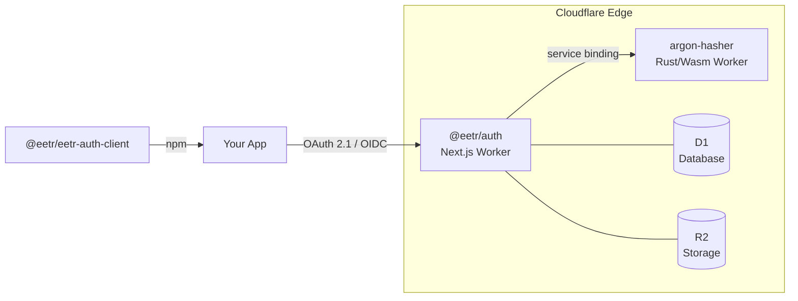
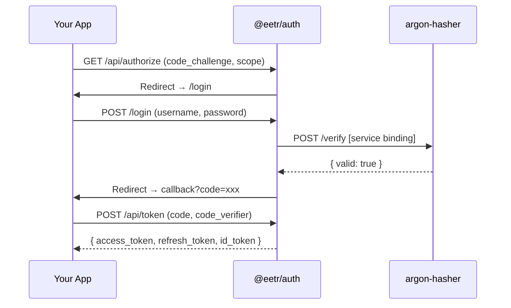
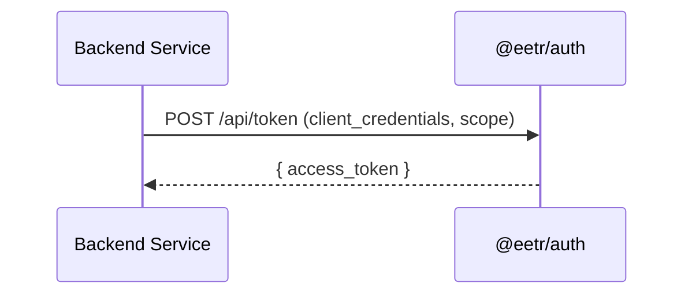

# eetr-auth

> A production-ready **OAuth 2.1 + OpenID Connect** authorization server, built for the Cloudflare edge.

Current release baseline: `0.5.1`. See [CHANGELOG.md](CHANGELOG.md). <!-- x-release-please-version -->

Public auth server package: `@eetr/auth`.

[](https://workers.cloudflare.com)
[](https://nextjs.org)
[](https://www.typescriptlang.org)
[](https://www.rust-lang.org)
[](https://github.com/eetr-ai/eetr-auth/actions/workflows/coverage-badge.yml)
[](LICENSE)

---

## What is this?

`eetr-auth` is a self-hostable OAuth 2.1 / OIDC authorization server that runs entirely on **Cloudflare's edge platform** — no VMs, no containers, no servers. The auth server product is published as `@eetr/auth`, and the repo ships as an npm monorepo with two Cloudflare Workers and a client library ready to publish.


```mermaid
graph LR
    APP["Your App"] -->|OAuth 2.1 / OIDC| AUTH

    subgraph CF["Cloudflare Edge"]
        AUTH["@eetr/auth\nNext.js Worker"]
        HASHER["argon-hasher\nRust/Wasm Worker"]
        D1[("D1\nDatabase")]
        R2[("R2\nStorage")]

        AUTH -->|service binding| HASHER
        AUTH --- D1
        AUTH --- R2
    end

    LIB["@eetr/eetr-auth-client"] -->|npm| APP
```

---

## Features

| Category | Highlights |
|---|---|
| **OAuth 2.1** | Authorization Code + PKCE (S256), Client Credentials, Refresh Token with rotation |
| **OpenID Connect** | OIDC discovery, JWKS endpoint, `/userinfo`, ID tokens (RS256) |
| **Authentication** | Password (Argon2id), Passkeys (WebAuthn) with multiple devices per user, Google sign-in |
| **Multi-factor** | Email OTP and authenticator-app (TOTP) — offered during sign-in and self-managed in settings |
| **Passkey self-service** | Enroll, rename, remove, and verify-on-this-device, all from user settings |
| **User flows** | Registration, email verification, password reset |
| **Theming** | Light, dark, and system themes across the sign-in and admin UI, with no-flash init |
| **Admin** | Dashboard for users, clients, tokens, audit log, site settings |
| **Infrastructure** | Cloudflare D1 (SQLite), R2 (object storage), Terraform provisioning |
| **Security** | Argon2id hashing in isolated WASM worker, HMAC-SHA256 request signing, PKCE mandatory |
| **Auth server package** | `@eetr/auth` — deployable OAuth 2.1 / OIDC server |
| **Client library** | `@eetr/eetr-auth-client` — token management, typed API, JWT validation |

---

## Monorepo Structure

```
eetr-auth/
├── apps/
│   ├── auth/               # @eetr/auth - Next.js 16 OAuth/OIDC server
│   └── argon-hasher/       # Rust/Wasm password hashing worker
├── packages/
│   └── eetr-auth-client/   # @eetr/eetr-auth-client (TypeScript, publishable)
├── infra/                  # Terraform (D1 + R2) and the Wrangler config template
├── scripts/                # Setup/deploy/db tooling (run via root npm scripts)
├── db/                     # D1 schema snapshot + versioned migration patches
└── docs/                   # Architecture, features, deployment, UX guidelines
```

Infrastructure (`infra/`), tooling (`scripts/`), and database files (`db/`) live at
the repo root and operate on the auth Worker; the ops `npm run` commands
(`setup:*`, `db:*`, `infra:*`, `jwt:*`) are defined in the root `package.json`.

---

## Quick Start

### Prerequisites

- Node.js 20+
- Rust + `wasm32-unknown-unknown` target
- Wrangler CLI v4+
- Terraform CLI v1.5+
- A Cloudflare account

### 1. Clone and install

```bash
git clone https://github.com/eetr-ai/eetr-auth.git
cd eetr-auth
npm install
```

### 2. Authenticate to Cloudflare

Terraform and Wrangler both read a Cloudflare **API token** from the environment — there is no provider block, so without this `terraform apply` fails with _"must provide exactly one of api_key, api_token…"_. Create a **Custom token** (Cloudflare dashboard → My Profile → API Tokens), scoped to your account, with: **D1** → Edit, **Workers R2 Storage** → Edit, **Workers Scripts** → Edit, and (optional) **Account Settings** → Read. Then export it in the shell you run the install from:

```bash
export CLOUDFLARE_API_TOKEN=your_token_here
export CLOUDFLARE_ACCOUNT_ID=your_account_id   # same as account_id in terraform.tfvars
```

Keep both exported for the rest of the flow — Terraform, `setup:remote`, and Wrangler all reuse them. Set `CLOUDFLARE_ACCOUNT_ID` if your token can access more than one account, or Wrangler may deploy to the wrong one (a `code: 10000` error whose URL shows an unexpected account id). See [infra/terraform/README.md](infra/terraform/README.md#L10) for the full permission rationale.

### 3. Provision infrastructure with Terraform

Fill in `infra/terraform/terraform.tfvars` (see DEPLOYMENT.md for each variable), then:

```bash
cd infra/terraform && terraform init && terraform apply && cd -
```

### 4. Deploy the hasher, then run automated setup

Run these from the repository root. `argon-hasher` must be deployed before the auth Worker:

```bash
npm run deploy:argon-hasher
npm run setup:remote
```

`npm run setup:remote` renders the Wrangler config, provisions secrets and JWT/JWKS material, applies the
fresh database schema, deploys the auth Worker, and seeds the bootstrap admin.

See the [Deployment guide](https://eetr-ai.github.io/eetr-auth/docs/getting-started/deployment) for the
complete step-by-step guide, including first-login hardening and DNS/JWKS setup.

---

## Using the Client Library

```bash
npm install @eetr/eetr-auth-client
```

### Validate a JWT

```typescript
import { validateJwt } from '@eetr/eetr-auth-client'

const payload = await validateJwt(
  accessToken,
  'https://auth.yourdomain.com/api/jwks.json'
)
```

### Manage tokens

```typescript
import { TokenManager, fetchOIDCDiscovery } from '@eetr/eetr-auth-client'

const discovery = await fetchOIDCDiscovery('https://auth.yourdomain.com')

const manager = new TokenManager({
  issuerUrl: 'https://auth.yourdomain.com',
  clientId: 'your-client-id',
  tokenEndpoint: discovery.token_endpoint,
})

const token = await manager.getAccessToken() // auto-refreshes when expired
```

### Call the userinfo endpoint

```typescript
import { getUserInfo } from '@eetr/eetr-auth-client'

const user = await getUserInfo(accessToken, discovery.userinfo_endpoint)
```

---

## Authentication Flows

### Authorization Code + PKCE


```mermaid
sequenceDiagram
    participant App as Your App
    participant Auth as @eetr/auth
    participant Hasher as argon-hasher

    App->>Auth: GET /api/authorize (code_challenge, scope)
    Auth->>App: Redirect → /login
    App->>Auth: POST /login (username, password)
    Auth->>Hasher: POST /verify [service binding]
    Hasher-->>Auth: { valid: true }
    Auth->>App: Redirect → callback?code=xxx
    App->>Auth: POST /api/token (code, code_verifier)
    Auth-->>App: { access_token, refresh_token, id_token }
```

### Client Credentials


```mermaid
sequenceDiagram
    participant Svc as Backend Service
    participant Auth as @eetr/auth

    Svc->>Auth: POST /api/token (client_credentials, scope)
    Auth-->>Svc: { access_token }
```

---

## Documentation

📖 **Full documentation: [eetr-ai.github.io/eetr-auth](https://eetr-ai.github.io/eetr-auth/)** — a
Fumadocs site (source in [apps/docs/](apps/docs/)) that publishes on each release.

| Section | Description |
|---|---|
| [Getting started](https://eetr-ai.github.io/eetr-auth/docs/getting-started) | Quick start, deployment, local dev, and the Cloudflare template guide |
| [Architecture](https://eetr-ai.github.io/eetr-auth/docs/architecture) | System design, bindings, flows, and the argon2id hashing worker |
| [Features](https://eetr-ai.github.io/eetr-auth/docs/features) | OAuth/OIDC grants, clients & DCR, auth, tokens, admin |
| [Guides](https://eetr-ai.github.io/eetr-auth/docs/guides) | MCP + DCR, WAF rate limiting, MFA/TOTP, SPA integration |
| [Reference](https://eetr-ai.github.io/eetr-auth/docs/reference) | Endpoint and configuration reference |
| [CHANGELOG.md](CHANGELOG.md) | Monorepo release history |

---

## Local Development

```bash
cd apps/auth

cp .env.example .env.local
cp .dev.vars.example .dev.vars

npm run jwt:generate-local-cert
npm run db:migrate
npm run db:create-admin:local
npm run dev
```

Server runs at `http://localhost:3000`.

---

## Tests & Coverage

```bash
npm test            # run the full suite across workspaces
npm run test:coverage   # same, with a V8 coverage report per workspace
```

CI runs the suite on every PR and posts a coverage comment per workspace
(`apps/auth`, `eetr-auth-client`) via the [CI workflow](.github/workflows/ci.yml).
The README coverage badge is the aggregate line coverage across both workspaces,
refreshed on every push to `main` by the
[Coverage Badge workflow](.github/workflows/coverage-badge.yml). That workflow
writes the badge value to a [public gist](https://gist.github.com/juancavallotti/6c3e9b0934625c845df2ffb18bfe4f6d)
using the `GIST_SECRET` repo secret.

> **Maintainers:** `GIST_SECRET` currently holds a GitHub token with `gist`
> scope. To rotate it to a least-privilege credential, mint a classic PAT with
> **only** the `gist` scope and run
> `gh secret set GIST_SECRET --repo eetr-ai/eetr-auth`. No workflow change needed.

---

## Stack

| Layer | Technology |
|---|---|
| Framework | Next.js 16 (App Router) via OpenNext |
| Runtime | Cloudflare Workers |
| Database | Cloudflare D1 (SQLite) |
| Storage | Cloudflare R2 |
| Password hashing | Argon2id (Rust → WASM, isolated Worker) |
| Token signing | RS256 JWT via `jose` |
| Sessions | NextAuth.js v5 |
| Passkeys | `@simplewebauthn/browser` + `@simplewebauthn/server` |
| Email | Resend |
| Infrastructure | Terraform (Cloudflare provider) |
| Testing | Vitest |
| Client library | TypeScript ESM, `jose` only dependency |

---

## License

MIT
