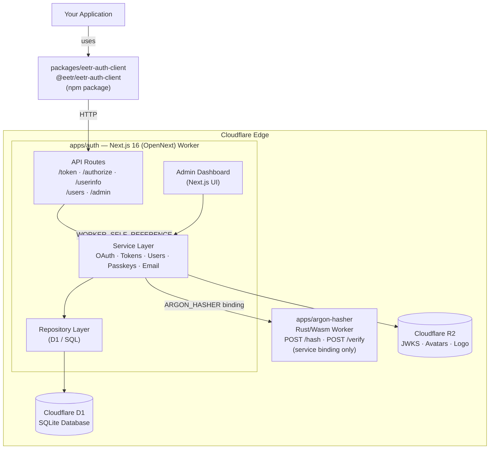
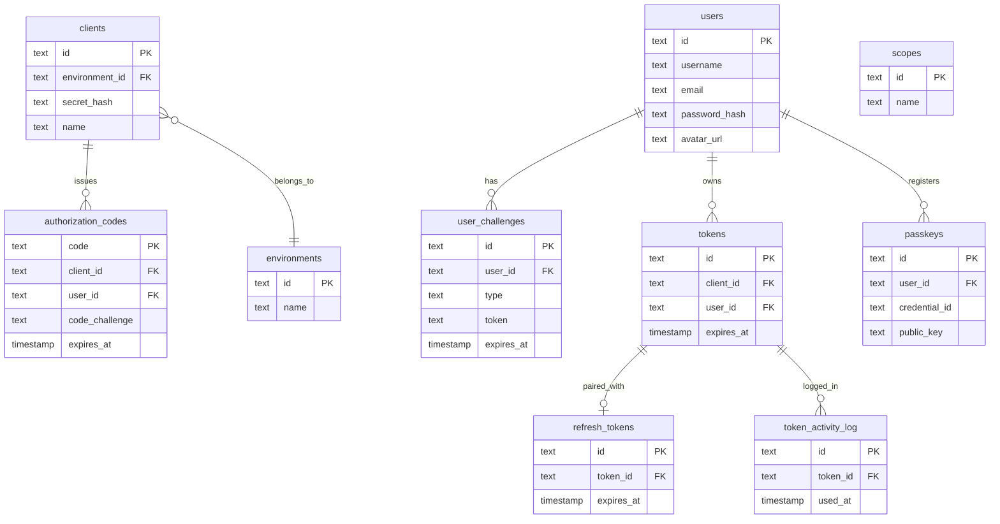
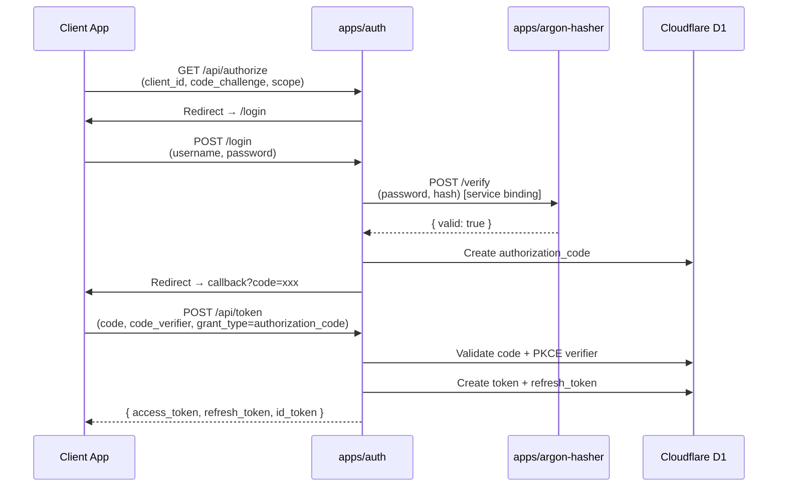
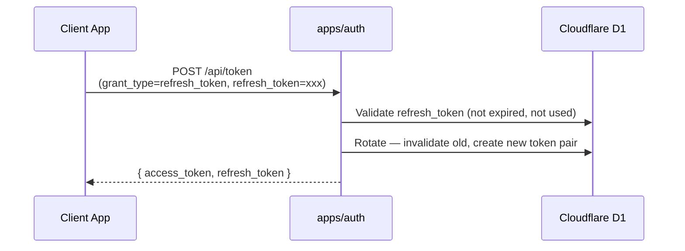
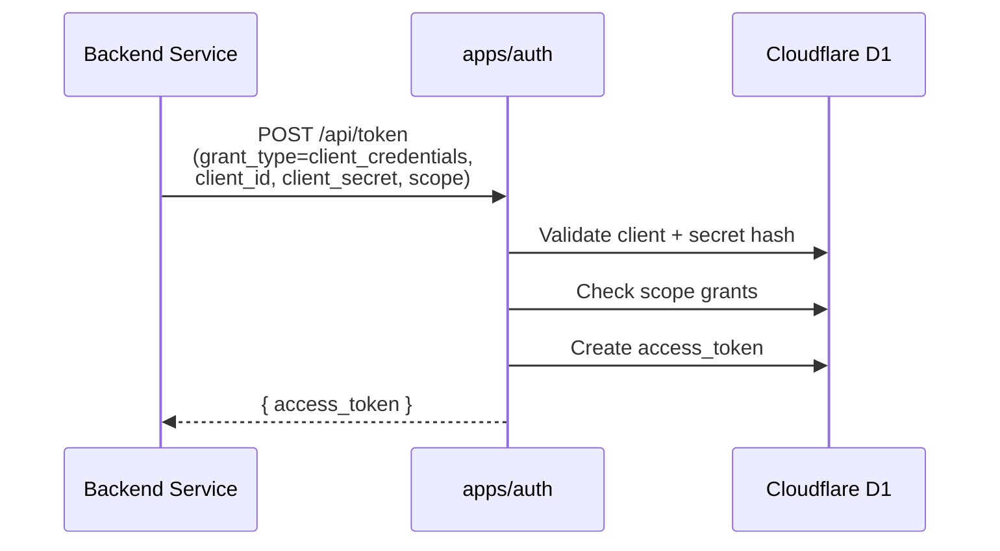
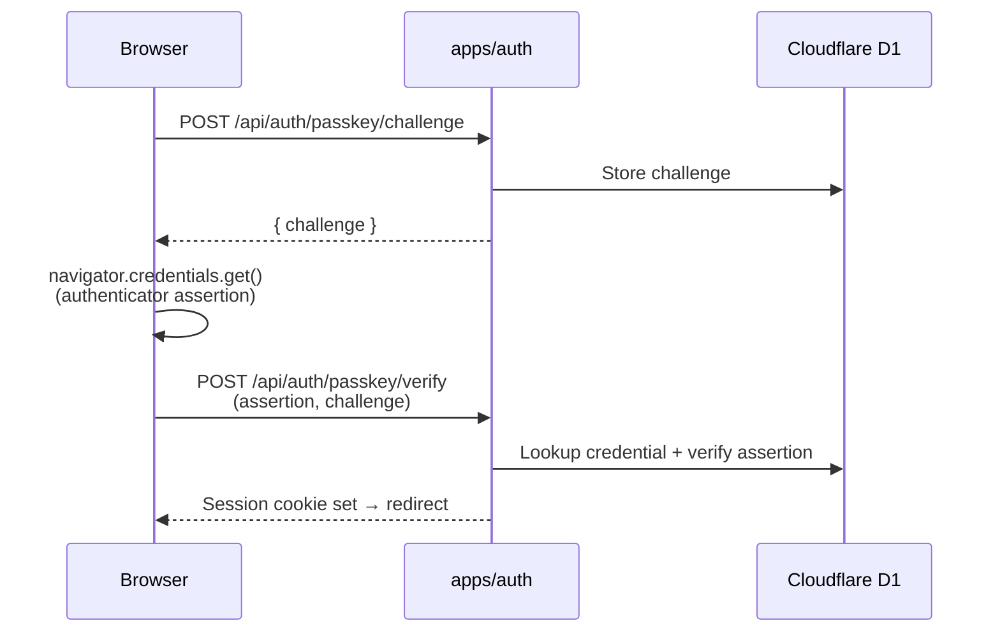
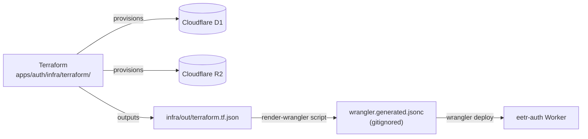
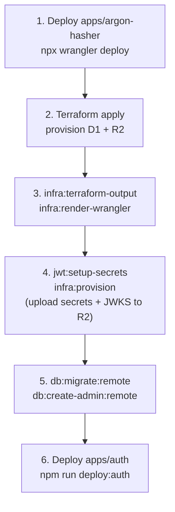

# Architecture

## System Overview

`eetr-auth` is a **Cloudflare-native OAuth 2.1 + OpenID Connect authorization server** packaged as an npm monorepo. It is designed to be deployed entirely on Cloudflare's edge platform with no traditional server infrastructure.



---

## Monorepo Packages

### `apps/auth`

The core OAuth 2.1 / OIDC authorization server. Built with Next.js 16 (App Router) and deployed via OpenNext to Cloudflare Workers.

**Technology:**
- Next.js 16 + React 19 (App Router)
- Cloudflare Workers runtime via `@opennextjs/cloudflare`
- Cloudflare D1 (SQLite) for persistence
- Cloudflare R2 for object storage (JWKS, avatars, site logo)
- NextAuth.js v5 for admin session management

**Internal Architecture:**

```
src/
├── app/                    # Next.js App Router
│   ├── api/                # REST API routes (OAuth, users, admin)
│   └── (auth|admin)/       # UI pages (login, dashboard)
└── lib/
    ├── services/           # Business logic (19 services)
    ├── repositories/       # Data access layer (D1 implementations)
    ├── auth/               # Auth utilities (JWT, HMAC, cookies)
    ├── config/             # Runtime config readers
    ├── context/            # Dependency injection registry
    ├── crypto/             # Cryptographic primitives
    └── db/                 # D1 connection helper
```

**Cloudflare Bindings:**

| Binding | Type | Purpose |
|---|---|---|
| `DB` | D1 Database | All persistent data (users, tokens, clients, etc.) |
| `BLOG_IMAGES` | R2 Bucket | User avatars, site logo, JWKS JSON |
| `IMAGES` | Images API | Cloudflare image optimization |
| `ASSETS` | Static Assets | OpenNext-compiled static files |
| `WORKER_SELF_REFERENCE` | Service Binding | Internal self-calls for routing/caching |
| `ARGON_HASHER` | Service Binding | Password hash/verify operations |

---

### `apps/argon-hasher`

An internal-only Cloudflare Worker written in Rust (compiled to WebAssembly). It implements Argon2id password hashing and is exposed exclusively via service binding — it rejects all requests that do not carry the `internal: true` prop.

**Endpoints (internal only):**

| Method | Path | Description |
|---|---|---|
| POST | `/hash` | Hash a plaintext password with Argon2id |
| POST | `/verify` | Verify a password against an Argon2id hash |

**Security model:** The worker checks `ctx.props.internal === true`. Any request without this prop receives a `403 Forbidden`. This means it can never be called directly from the internet — only via the `ARGON_HASHER` service binding from `apps/auth`.

**Deployment constraint:** Must be deployed **before** `apps/auth`.

---

### `packages/eetr-auth-client`

A published TypeScript library (`@eetr/eetr-auth-client`) for consuming the auth server from client applications and backend services.

**Modules:**

| Module | Description |
|---|---|
| `types` | TypeScript interfaces for all API request/response shapes |
| `discovery` | Fetch OIDC discovery and OAuth server metadata |
| `api` | Typed fetch wrappers for all server endpoints |
| `tokens` | `TokenManager` — stateful access token lifecycle management |
| `jwt` | JWT validation against server JWKS + payload decoding |

**Design principles:**
- Zero framework dependencies — works in browser, Node.js, and Cloudflare Workers
- `jose` is the only runtime dependency (JWT operations)
- All functions accept explicit configuration rather than global singletons
- `TokenManager` uses in-memory storage by default; consumers can override for persistence

---

## Database Schema

The D1 database contains 23 tables organized around these domains:



---

## Authentication Flows

### Authorization Code + PKCE (S256)



### Token Refresh



### Client Credentials



### Passkey Sign-In



---

## Infrastructure



Terraform (`apps/auth/infra/terraform/`) provisions:
- Cloudflare D1 database
- Cloudflare R2 bucket

The `wrangler.generated.jsonc` (gitignored) is rendered from Terraform outputs via `npm run infra:render-wrangler` inside `apps/auth`.

---

## Deployment Order



See [DEPLOYMENT.md](./DEPLOYMENT.md) for full step-by-step instructions.
